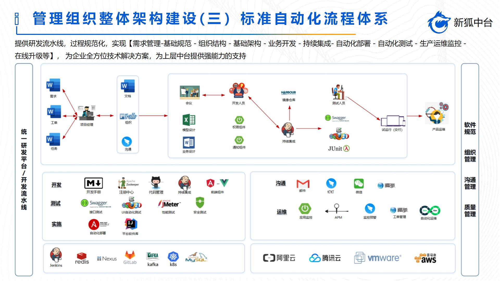
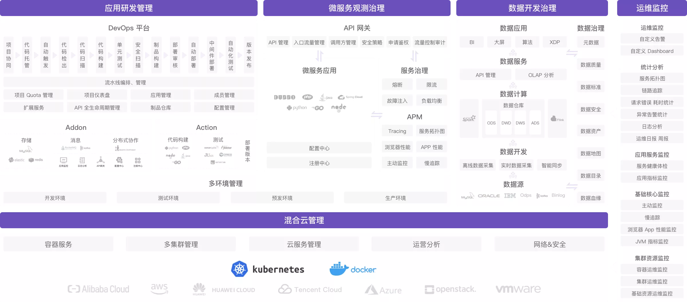
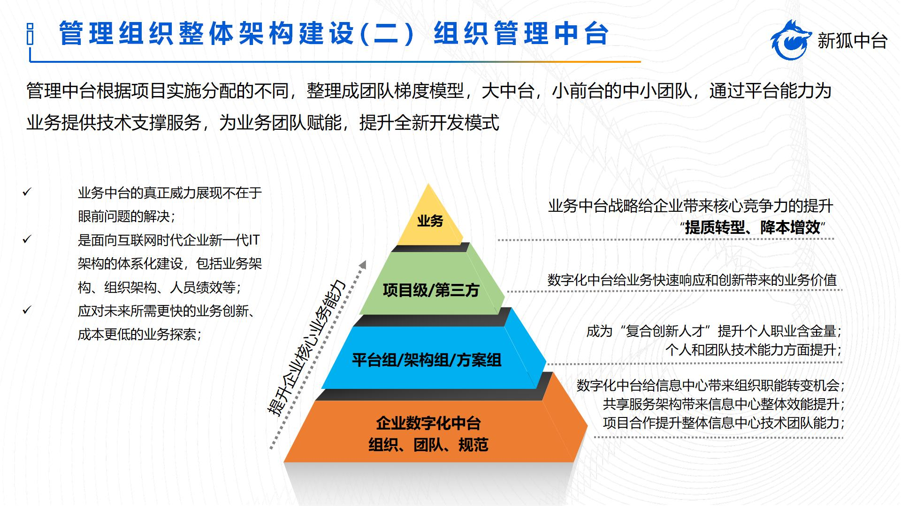
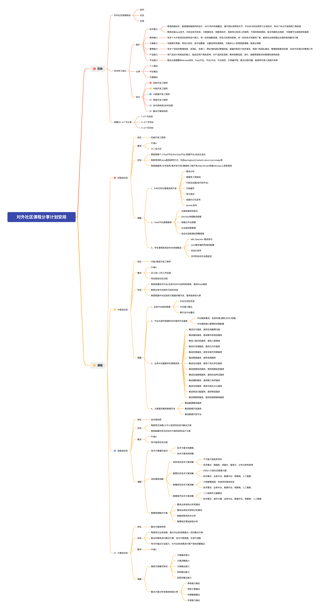
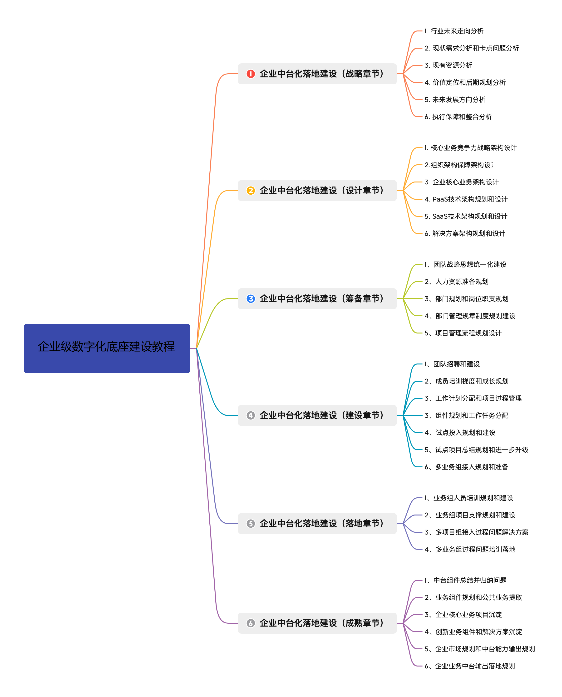
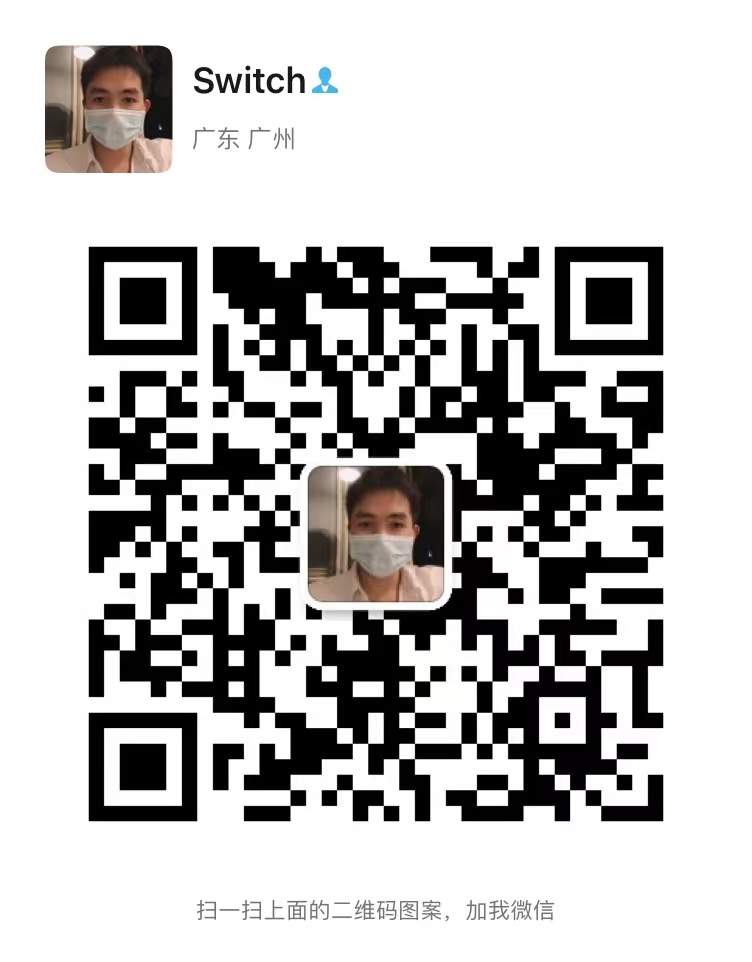

# 企业级数字化底座建设

> 本基线主要为了学习交流学习使用，请勿用于相关的商业活动，包括其中的架构图，资料等

### 概述

企业级数字化底座平台，用于数字化平台底座的搭建学习交流群，用于分享和解决企业数字化的建设和搭建教程，基于中台架构，构建技术/业务/组织/数据中台，更好的支撑企业数字化转型建设，进一步提升企业信息化。

当前软件人才的建立，不能仅仅是照着以前的建设思路进行的梳理整合，更多的是对资源的整合点，软件项目的开发，人才的培养，更多的是建议在多方面人才的成长，提出新一代的软件开发人才和技能成长要求。

### 建设说明

整体建设从0到1的过程，包括数字化涉及到的相关技术，过程问题，组织调整等，进一步的整合学习，为下一步智能化的发展提供提一步的基础准备。

### 建设内容

整体建设通过“1+3+N”的整合思路，进行整体的建设，为企业数字化和智能化打下进一步的基础。

1. 整体企业中台建设规划（1个平台+3个底座+N套业务）
2. 管理组织整体架构建设
3. 基础技术底座架构建设
4. 基础研发组件设计建设
5. 数据治理套件设计建设
6. 业务中台套件建设沉淀（企业解决方案、资产沉淀）

### 数字化底座架构

整体数字化底座架构规划:

基础PaaS平台架构

整体数字化平台功能架构

> 此图来自端点科技架构功能，后期更新

组织管理中台架构

### 输出内容

- 技术输出
- 架构输出
- 中台输出
- 方案输出
- 落地输出

### 建设输出

#### 数字化人才培养输出

#### 企业级中台搭建输出

> 视频教程录制内容，包括文本和PDF、app等这块人员

### 开源交流群
 
加入我们的开源社区进行互相交流，关注微信号，拉入群学习，添加时备注【社区】

 

### 当前贡献者 ✨

项目运维和管理团队，也希望有更多的同学可以参与到数字化建设 :-)

<!-- ALL-CONTRIBUTORS-LIST:START - Do not remove or modify this section -->
<!-- prettier-ignore-start -->
<!-- markdownlint-disable -->
<table>
  <tr>
    <td align="center"><a href="https://github.com/switchII"> <b>LuoXiaoDong</b></a></td>
    <td align="center"><a href="https://github.com/zgm4z"> <b>ZhuoGuangMing</b></a></td>
  </tr>
</table>

<!-- markdownlint-restore -->
<!-- prettier-ignore-end -->

<!-- ALL-CONTRIBUTORS-LIST:END -->
 
工作很多年，希望能把一些不同于市面上的东西拿出来分享交流，让大家一起进步。 如果觉得项目对您有帮助，请点 Star 支持一下，欢迎加入社区群一起讨论。
